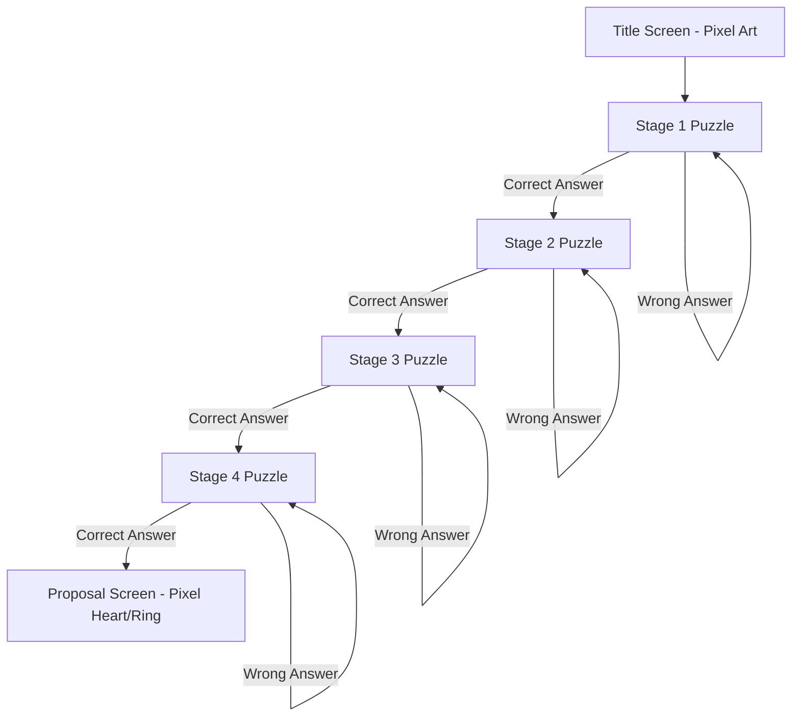

# Puzzle Proposal Game - Architecture Plan (Retro 16-Bit Edition)

## Overview

A mobile-first browser-based puzzle/escape room game with a **retro 16-bit pixel aesthetic**. Designed to work **amazingly on small screens** first, with graceful scaling for desktop. 3-4 stages of puzzles leading to a marriage proposal. All content is configured via a single JavaScript config file -- no coding required to customize.

### Mobile-First Design Principles

| Principle | Implementation |
|-----------|---------------|
| **Touch-first** | All interactive elements are minimum 44x44px touch targets |
| **Thumb-friendly** | Key controls placed in bottom thumb-reach zone |
| **Viewport-adaptive** | Scales from 320px (iPhone SE) to any desktop width |
| **Keyboard-aware** | Input fields adjust when virtual keyboard appears |
| **Battery-conscious** | Animations optimized to minimize GPU/CPU load |
| **Data-light** | Minimal assets, optional audio, works offline |
| **Orientation-flexible** | Works in portrait (primary) and landscape modes |

### Mobile Layout Strategy

```
Portrait (Primary - 320px to 428px width)
+----------------------------------+
|  [Progress Dots]                 |  <- Top bar: stage indicator
+----------------------------------+
|                                  |
|     [Pixel Art - Scaled Down]   |  <- Centered art, max 120px
|                                  |
+----------------------------------+
|  +--------------------------+    |
|  |  Dialogue Box            |    |  <- Scrollable text area
|  |  "Clue text here..."     |    |
|  +--------------------------+    |
+----------------------------------+
|  [ Input Field (full width) ]    |  <- Large touch target
+----------------------------------+
|  [ CHECK ]                       |  <- Bottom action button
+----------------------------------+

Landscape / Desktop (768px+)
+--------------------------------------------+
|  [Progress Dots]          |  [Pixel Art]   |  <- Split layout
+---------------------------+   Art + Clue   |
|                           +----------------+
|  Dialogue Box (wider)     |  "Clue text..."|
|  "Full clue text here..." |                |
+---------------------------+  [Input] [Btn] |
|                           +----------------+
|  [ CHECK ]                                |
+--------------------------------------------+
```

---

## Game Flow Diagram



---

## Configuration System

All game content is configured in a single `CONFIG` object at the top of `js/game.js`:

```javascript
const CONFIG = {
    // Title screen
    title: "A Quest For Love",
    subtitle: "Will you embark on this adventure?",
    startButton: "Begin Adventure",

    // Puzzle stages
    stages: [
        {
            id: 1,
            title: "Chapter 1: Where It All Began",
            clue: "We both love zombies... remember the movie night? Look at the poster title!",
            answer: ["zombieland", "the zombieland", "zombie land", "zombie-land"],
            pixelArt: "movie-poster.png",
        },
        {
            id: 2,
            title: "Chapter 2: Dangerously Close",
            clue: "Remember when we got a little too close? That moment changed everything...",
            answer: ["first kiss", "our first kiss", "the first kiss"],
            pixelArt: "first-kiss.png",
        },
        {
            id: 3,
            title: "Chapter 3: The Heart",
            clue: "Our love counter: x 2,458 → x 10,000 → x 1,000,000 ... What comes next?",
            answer: ["infinity", "inf", "infinite", "x infinity", "x inf", "x infinite"],
            pixelArt: "infinity-counter.png",
        },
        {
            id: 4,
            title: "Chapter 4: Player 2 Joined",
            clue: "You've conquered the zombie lands, survived the dangerous frontier, and proved your love is infinite. The final level requires 2 players... Ready to play forever together?",
            // Stage 4 uses a co-op mechanic instead of text input
            // Both players must press their buttons simultaneously to proceed
            coOp: {
                player1Label: "Player 1: Press A",
                player2Label: "Player 2: Press B",
                timeout: 5000,
                promptText: "Both players tap together!",
            },
        },
    ],

    // Proposal screen
    proposal: {
        message: "Every quest has led to this moment...",
        question: "Will you marry me?",
        buttonYes: "YES! 💍",
        buttonNo: "Are you sure? 🥺",
        // Note: buttonNo runs away to random positions when clicked/hovered,
        // eventually accepting as "yes" anyway
        afterYes: "She said YES! Forever begins now!",
        partnerName: "My Dearest",
    },

    // Audio (optional)
    sounds: {
        correct: "correct.wav",
        wrong: "wrong.wav",
        proposal: "victory.wav",
    },
};
```

**To customize:** Just edit the strings, answers, and clues in this object. No other code changes needed.

---

## Retro 16-Bit Aesthetic Details

### Visual Style
- **Pixel font:** Press Start 2P or VT323 from Google Fonts
- **Color palette:** SNES-style palette (deep purples, teals, warm yellows, pixel reds)
- **UI elements:** Boxed dialogue boxes with pixel borders (like Final Fantasy / Zelda text boxes)
- **Background:** Dark with subtle pixel grid or starfield pattern
- **Cursor:** Pixelated arrow or heart cursor
- **Transitions:** Screen flash or scroll effect between stages

### Pixel Art Elements
- Heart icon (pixel art) for the proposal
- Ring icon (pixel art) for the proposal
- Small decorative pixel art per stage (key, star, heart, etc.)
- Can use emoji rendered in pixel style or actual pixel art images

### Dialogue Box Style
```
+----------------------------------+
|  Chapter 1: Where It All Began  |
|                                  |
|  "Our story started where the   |
|   coffee flows..."              |
|                                  |
|  [ Enter your answer...    ]    |
|                                  |
|  [ CHECK ]                      |
+----------------------------------+
```

### Animations
- **Typewriter effect** for clue text (characters appear one by one)
- **Pixel heart beat** animation on the proposal screen
- **Screen shake** on wrong answer
- **Star sparkle** on correct answer
- **Confetti** but pixel-style (blocky particles)

### Pixel Art Design Details

#### Mobile Pixel Art Guidelines
- **Max art size:** 120px on mobile, 240px on desktop
- **Sprite format:** PNG with transparency, optimized for small dimensions
- **Color depth:** 8-bit palette (256 colors max) for fast loading
- **Asset size:** Each image under 50KB, total images under 500KB

#### Title Screen
- **Animated pixel heart** floating in center with gentle bob animation (up/down 4px loop)
- **Pixel stars** twinkling in background (random opacity flicker every 2-3 seconds)
- **Pixel ring icon** that rotates slowly (8-frame rotation sprite)
- **Gradient sky** background transitioning from deep purple (#1a0a2e) to teal (#0d3b66) to warm gold (#f5a623)
- **Pixel clouds** drifting slowly across the sky (parallax scrolling at different speeds)
- **Mobile adaptation:** Art scales to 80% of viewport width, text uses `clamp()` for readability

#### Stage 1 - Movie Night Theme
- **Pixel movie poster** (Zombieland) with glowing border effect
- **Pixel yellow hatchback** car parked in night scene (headlights on)
- **Pixel couple silhouette** standing outside the car, boy holding up poster
- **Night sky background** with stars and crescent moon
- **Pixel popcorn bucket** and soda cup as decorative elements at the bottom
- **Movie projector beam** effect (semi-transparent triangle from top)
- **Cat easter egg:** A small pixel cat sitting on the hood of the yellow hatchback, tail wrapped around its paws
- **Mobile adaptation:** Poster scales to 60% of screen width, car silhouette at bottom

#### Stage 2 - First Kiss Theme
- **Boy and girl face to face**, very close to each other, both with **rosy cheeks** (blushing, nervous but excited)
- They are the **focus of the scene** — close-up shot capturing the moment before their first kiss
- **Background:** Soft bokeh lights (blurred city/fairy lights) creating a dreamy romantic atmosphere
- **Crescent moon** peeking through light clouds above
- **Faint stars** twinkling in the background
- **Cat easter egg:** A small pixel cat sitting underneath the couple, looking up at them

#### Stage 3 - Infinity Counter Theme
- **Pixel text message bubbles** styled like a phone chat screen with **alternating sides** (simulating two people texting)
- Left bubble (yours): "I love you x 2458 🏝️"
- Right bubble (partner's): "I love you x 10000 🏝️"
- Left bubble (yours): "I love you x 1000000 🏝️"
- Right bubble (partner's) — **fades in with glowing effect**: "I love you x ∞ 🏝️"
- **Typing indicator** ("...") appears below the last bubble while waiting for the player's answer (pulsing animation)
- **Cat easter egg:** A tiny cat emoji (🐱) hidden inside one of the text message bubbles
- **Background:** Dark phone screen with pixel keyboard at the bottom

#### Stage 4 - Player 2 Joined (Co-Op Gaming Theme)
- **Two pixel characters** (boy and girl) sitting side-by-side on a couch or floor, each holding a game controller
- **TV screen** in front of them displaying a mini co-op game with pixel art heroes
- **Warm TV glow** illuminating their faces (subtle blue/purple light pulsing)
- **Cozy room background:**
  - Pixel couch or bean bags they're sitting on
  - Bowl of popcorn and two drinks nearby
  - Fairy lights or LED strip along the wall
  - Game shelves in the background with retro game cartridges
- **Character expressions:**
  - Boy: Focused but happy, glancing at the girl with a smile
  - Girl: Engaged in the game, smiling, looking at him curiously
  - Both: Rosy cheeks (blushing), eyes lit up from the TV screen
- **TV screen content:** Mini pixel animation cycling (heroes walking, hearts filling)
- **Scanline overlay** on the TV screen for retro CRT feel
- **Snacks:** Pixel popcorn bowl and drinks on a small table beside the couch

#### Proposal Screen
- **Pixel ring** with animated sparkle effect (4-frame sparkle sprite cycling)
- **Pixel heart** explosion (particles burst outward from center in 8 directions)
- **Pixel text** appearing letter by letter with typewriter effect
- **Animated pixel flowers** growing from bottom of screen (frame-by-frame growth)
- **Pixel confetti** in multiple layers (foreground and background particles)
- **Pixel fireworks** bursting at random positions (expanding ring animation)

#### Background Patterns
- **Starfield pattern:** Multiple layers of stars at different opacities and sizes
- **Pixel grid overlay:** Subtle 4x4 grid pattern at 5% opacity for authentic retro feel
- **Scanline effect:** Thin horizontal lines every 2 pixels at 3% opacity for CRT monitor feel
- **Vignette:** Darkened edges with smooth gradient (center fully visible, edges at 70% opacity)

---

## Asset Creation Guide

### Directory Structure

```
images/
└── clue-art/
    ├── stage1.png    (Zombieland movie poster theme)
    ├── stage2.png    (First kiss theme)
    ├── stage3.png    (Infinity counter theme)
    └── stage4.png    (Treasure chest theme)
```

### Asset Requirements

| Property | Requirement |
|----------|-------------|
| **Format** | PNG (lossless, transparency support) |
| **Max dimensions** | 240x240px (desktop), 120x120px (mobile auto-scaled) |
| **Color depth** | 8-bit palette (256 colors max) |
| **File size** | Each image under 50KB |
| **Transparency** | Required (alpha channel) |
| **Naming** | `stage1.png` through `stage4.png` |

### Asset Fallback System

The game automatically falls back to emoji when images fail to load:

| Stage | Emoji Fallback |
|-------|---------------|
| Stage 1 | 🎬 (movie clapper) |
| Stage 2 | 💋 (kiss mark) |
| Stage 3 | ♾️ (infinity) |
| Stage 4 | 💎 (gem stone) |

### Creating Custom Assets

1. Create pixel art at 16x16 or 32x32 resolution
2. Export as PNG with transparency
3. Optimize to under 50KB (use tools like PNGGauntlet or TinyPNG)
4. Place in `images/clue-art/` directory
5. The game will automatically load the image and fall back to emoji if it fails

---

## Animation System

### Mobile Animation Guidelines
- **Performance first:** Prefer CSS transforms over JS animations (GPU accelerated)
- **Reduced particle count:** 50% fewer particles on mobile devices
- **Battery mode:** Disable ambient animations when `prefers-reduced-motion` detected
- **Frame budget:** All animations complete within 16ms per frame (60fps target)

### Screen Transitions
- **Stage transition:** Screen wipe from left to right (pixel by pixel reveal)
- **Title to game:** Zoom in effect (scale 100% to 150% then back to 100%)
- **Proposal reveal:** Curtain pull effect (top and bottom panels slide away)
- **Wrong answer:** Screen shake (4px left/right oscillation, 6 frames)
- **Correct answer:** Screen flash white (1 frame) then star burst from input field
- **Mobile adaptation:** Shorter transition durations (80% of desktop) for faster interaction

### Input Animations
- **Typewriter effect:** Text appears character by character (50ms per character)
- **Input field glow:** Border pulses gold when focused
- **Button hover:** Pixel scale up (95% to 100%) with color shift
- **Button press:** Pixel scale down (100% to 95%) with shadow change
- **Correct answer:** Input border turns green with sparkle particles
- **Wrong answer:** Input border turns red with shake animation
- **Mobile adaptation:** Use `:active` pseudo-class for tap feedback, increase animation duration slightly

### Ambient Animations
- **Floating particles:** Small pixel dots drifting upward (random speed, random opacity)
- **Heart floaters:** Tiny pixel hearts rising from bottom (every 3 seconds, random position)
- **Star twinkle:** Background stars flickering at random intervals
- **Torch flicker:** Light sources pulsing with random intensity
- **Cloud drift:** Background clouds moving horizontally at different speeds
- **Mobile adaptation:** Reduce particle count by 50%, increase animation duration by 25%

### Proposal Screen Special Effects
- **Pixel confetti cascade:** Blocky particles falling from top in multiple colors
- **Heart burst:** 8 pixel hearts exploding outward from center
- **Ring sparkle:** 4-point star sparkle rotating around the ring
- **Fireworks:** Expanding pixel rings in random positions
- **Text glow:** Proposal text pulsing with golden glow
- **Flower growth:** Pixel flowers growing frame-by-frame from bottom edge
- **Mobile adaptation:** Limit confetti to 30 particles (vs 60 on desktop), use simpler sparkle patterns

### Mobile-Specific Animations
- **Pull-to-refresh:** Dismissible gesture to restart the game
- **Swipe navigation:** Swipe left/right between stages (with visual indicator)
- **Haptic feedback:** Vibrate on correct/wrong answer (if device supports)
- **Tap to advance:** Tap anywhere on screen to proceed (with visual cue)

---

## Audio Design

### Music (Background)
- **Title screen:** Gentle 8-bit melody inspired by Final Fantasy wedding pieces
  - Tempo: 120 BPM
  - Instruments: Square wave lead, triangle bass, noise percussion
  - Loop: 8-bar melody with subtle variation on repeat

- **Gameplay:** Light puzzle-themed chiptune
  - Tempo: 100 BPM
  - Instruments: Square wave melody, triangle bass, simple arpeggios
  - Mood: Curious, adventurous, hopeful
  - Loop: 16-bar composition

- **Proposal screen:** Emotional victory fanfare
  - Tempo: 140 BPM
  - Instruments: Full square wave chord progression, triangle melody, noise drums
  - Inspired by: Zelda victory fanfare, EarthBound celebration music
  - Loop: 8-bar triumphant melody

### Sound Effects
- **Correct answer:**
  - Ascending 3-note chime (C5-E5-G5)
  - Duration: 300ms
  - Instruments: Square wave with quick decay

- **Wrong answer:**
  - Descending dissonant tone (A4-F4)
  - Duration: 400ms
  - Instruments: Square wave with medium decay

- **Stage transition:**
  - Quick whoosh (filtered noise sweep)
  - Duration: 200ms
  - Instruments: Noise with low-pass filter sweep

- **Button click:**
  - Short blip (C6)
  - Duration: 50ms
  - Instruments: Square wave with fast decay

- **Proposal reveal:**
  - Victory fanfare (C-E-G-C ascending)
  - Duration: 1000ms
  - Instruments: Full chord progression

- **YES button press:**
  - Heartbeat sound (thump-thump)
  - Duration: 600ms
  - Instruments: Triangle wave with low frequency

- **Confetti burst:**
  - Random pitch sparkle cascade
  - Duration: 2000ms
  - Instruments: Multiple square waves at random frequencies

### Audio Implementation Notes
- **Format:** WAV files (8-bit, 22kHz for authentic retro sound)
- **Alternative:** Generate sounds programmatically using Web Audio API (no files needed)
- **Volume control:** Configurable master volume in CONFIG
- **Mute option:** Persistent mute toggle (stored in localStorage)
- **Music volume:** Separate from SFX volume for customization

---

## Project Structure

```
thething/
├── index.html          # Main game file
├── css/
│   └── style.css       # Mobile-first responsive styling
├── js/
│   ├── game.js         # Game engine + CONFIG object
│   ├── confetti.js     # Pixel confetti effect
│   └── sw.js           # Service Worker for PWA
├── icons/
│   ├── pixel-heart-192.png  # PWA icon (192x192)
│   └── pixel-heart-512.png  # PWA icon (512x512)
├── manifest.json       # PWA web app manifest
├── images/
│   ├── heart.png       # Pixel art heart
│   ├── ring.png        # Pixel art ring
│   ├── clue-art/       # Stage-specific pixel art
│   │   ├── stage1.png
│   │   ├── stage2.png
│   │   ├── stage3.png
│   │   └── stage4.png
│   └── bg/
│       └── stars.png   # Background pattern
└── audio/
    ├── correct.wav     # 8-bit correct sound
    ├── wrong.wav       # 8-bit wrong sound
    └── victory.wav     # Victory fanfare
```

---

## Technical Architecture

### Single Page Application (SPA)
All stages in one `index.html`. JavaScript shows/hides stages.

### Core Components

#### Stage Manager (game.js)
```
- currentStage: tracks active stage
- showStage(stageNumber): hides all, shows target
- validateAnswer(stageNumber, answer): checks against CONFIG
- nextStage(): advances to next
```

#### Answer Validation
- Case-insensitive comparison
- Supports multiple valid answers per stage (array in CONFIG)
- Trims whitespace automatically

#### Pixel Confetti System
- Blocky, pixel-style particle animation
- Canvas-based
- Triggers on proposal screen reveal
- Colors: pixel red, gold, white, pink

### HTML Structure
```html
<section id="stage-title" class="stage active">...</section>
<section id="stage-1" class="stage">...</section>
<section id="stage-2" class="stage">...</section>
<section id="stage-3" class="stage">...</section>
<section id="stage-4" class="stage">...</section>
<section id="stage-proposal" class="stage">...</section>
```

### CSS Approach (Mobile-First)

#### Base Styles (320px and up)
- **Font:** Press Start 2P with `clamp()` for fluid scaling
- **Pixel borders:** Using `box-shadow` for authentic pixel border effect
- **Dialogue boxes:** Styled like retro RPG text boxes
- **Animations:** CSS keyframes for typewriter, shake, pulse, sparkle
- **Layout:** Flexbox column layout (mobile default)

#### Responsive Breakpoints
```css
/* Mobile First - Base styles for 320px-428px */
.game-container {
  width: 100%;
  max-width: 100vw;
  padding: 12px;
  flex-direction: column;
}

/* Tablet - 429px to 767px */
@media (min-width: 429px) {
  .game-container { max-width: 480px; padding: 16px; }
}

/* Desktop - 768px and up */
@media (min-width: 768px) {
  .game-container {
    max-width: 800px;
    display: grid;
    grid-template-columns: 1fr 280px;
    gap: 24px;
    padding: 32px;
  }
}

/* Large Desktop - 1024px and up */
@media (min-width: 1024px) {
  .game-container { max-width: 960px; }
}
```

#### Mobile-Specific CSS Techniques
- **Viewport height fix:** Use `dvh` units with `vh` fallback for mobile browser chrome
- **Touch feedback:** `:active` states instead of `:hover` for mobile tap feedback
- **Scrollable dialogue:** `max-height` with `overflow-y: auto` for long clues
- **Input scaling:** `font-size: 16px` minimum to prevent iOS zoom on focus
- **Safe areas:** `padding: env(safe-area-inset-bottom)` for notched devices
- **Dark mode:** Respects `prefers-color-scheme` with mobile-optimized palette

---

## GitHub Pages Deployment

### Basic Deployment
1. Commit all files to the repository
2. Go to Settings -> Pages
3. Set source to main branch
4. Access at `https://yourusername.github.io/thething/`

### Mobile Optimization for Deployment
- **HTTPS required:** GitHub Pages provides free SSL (required for PWA)
- **Custom domain:** Optional for branded sharing (e.g., `marry.me/username`)
- **Short URL:** Use URL shortener for easy sharing on mobile
- **QR code:** Generate QR code linking to the game for in-person sharing

### PWA Deployment (Optional)
Add these files for mobile app-like experience:

**`manifest.json`:**
```json
{
  "name": "A Quest For Love",
  "short_name": "Our Quest",
  "description": "A puzzle adventure leading to forever",
  "start_url": "/",
  "display": "standalone",
  "orientation": "portrait",
  "background_color": "#1a0a2e",
  "theme_color": "#1a0a2e",
  "icons": [
    {
      "src": "icons/pixel-heart-192.png",
      "sizes": "192x192",
      "type": "image/png"
    },
    {
      "src": "icons/pixel-heart-512.png",
      "sizes": "512x512",
      "type": "image/png"
    }
  ]
}
```

**`sw.js` (Service Worker):**
```javascript
const CACHE_NAME = 'quest-for-love-v1';
const ASSETS = [
  '/',
  'index.html',
  'css/style.css',
  'js/game.js',
  'js/confetti.js',
  'images/heart.png',
  'images/ring.png',
  // ... all assets
];

self.addEventListener('install', (e) => {
  e.waitUntil(caches.open(CACHE_NAME).then((c) => c.addAll(ASSETS)));
});

self.addEventListener('fetch', (e) => {
  e.respondWith(caches.match(e.request).then((r) => r || fetch(e.request)));
});
```

---

## Customization Checklist

You only need to edit the `CONFIG` object in `js/game.js`:
- [ ] Puzzle clues for each stage
- [ ] Correct answers for each puzzle
- [ ] Proposal message and partner name
- [ ] Title screen text
- [ ] Optional: pixel art images per stage
- [ ] Optional: 8-bit sound effects

---

## Accessibility & Performance

### Accessibility Features
- **Keyboard navigation:** Full game playable with Tab/Enter/Escape keys
- **Screen reader support:** ARIA labels on all interactive elements
- **Focus indicators:** Visible pixel-style focus rings on all buttons/inputs
- **Color contrast:** All text meets WCAG AA contrast ratios (4.5:1 minimum)
- **Reduced motion option:** CONFIG flag to disable animations for users with vestibular disorders
- **Text scaling:** Responsive font sizes that respect user's system font preferences
- **Alternative text:** All pixel art has descriptive alt text via CONFIG

### Performance Optimizations
- **Sprite sheets:** Combine pixel art into single images (reduces HTTP requests)
- **Lazy loading:** Load pixel art images only when their stage is reached
- **CSS animations:** Prefer CSS transforms over JS animations (GPU accelerated)
- **Canvas optimization:** Use requestAnimationFrame for confetti/particle effects
- **Audio sprites:** Combine SFX into single audio file with Web Audio API decoding
- **Font loading:** Preload Press Start 2P font with <link preload>
- **Mobile performance:** Reduce particle count on low-end devices (detect via navigator.hardwareConcurrency)

### Mobile-First Design

#### Touch Interaction Design
- **Touch targets:** Minimum 44x44px for all buttons (Apple HIG compliant)
- **Thumb zone:** Primary action buttons in bottom 30% of screen
- **Touch feedback:** Visual ripple effect on tap (50ms duration)
- **Tap delay:** Zero tap delay with `touch-action: manipulation` CSS
- **Swipe gestures:** Swipe left/right between stages with visual page indicator
- **Pull to restart:** Pull down gesture to restart the game

#### Viewport & Layout
- **Viewport meta:** `<meta name="viewport" content="width=device-width, initial-scale=1.0, maximum-scale=5.0, user-scalable=yes">`
- **Dvh units:** Use `100dvh` for full height with mobile browser chrome
- **Safe areas:** `padding: env(safe-area-inset-bottom)` for notched devices
- **No horizontal scroll:** Content fits within viewport width at all times
- **Fluid typography:** `clamp()` for font sizes that scale between breakpoints
- **Flexible images:** `max-width: 100%; height: auto` for all pixel art

#### Virtual Keyboard Handling
```javascript
// Detect keyboard height and adjust layout
const adjustForKeyboard = () => {
  const keyboardHeight = window.visualViewport.height
    ? window.innerHeight - window.visualViewport.height
    : 0;

  if (keyboardHeight > 100) {
    document.body.style.paddingBottom = keyboardHeight + 'px';
    activeInput.scrollIntoView({ behavior: 'smooth' });
  }
};
```

#### Mobile Performance
- **Asset budget:** Total page load under 1MB (mobile data concerns)
- **Image optimization:** PNG with `pngquant` for smallest file size
- **Font loading:** Preload font, use `font-display: swap`
- **Service worker:** Cache all assets for offline play
- **Battery mode:** Reduce animations when `low-data-mode` detected
- **Memory management:** Dispose of particle effects when stage changes

#### Orientation Handling
```css
/* Portrait - Primary layout */
.game-container {
  flex-direction: column;
  max-width: 100%;
}

/* Landscape - Adjusted for wider view */
@media (orientation: landscape) and (max-height: 600px) {
  .game-container {
    flex-direction: row;
    max-height: 90vh;
  }
  .pixel-art { max-height: 150px; }
  .dialogue-box { max-height: 200px; }
}
```

#### Mobile Browser Compatibility
- **iOS Safari:** Test on iOS 14+, handle viewport height quirks
- **Android Chrome:** Test on Chrome 90+, handle keyboard behavior
- **Samsung Internet:** Test on Samsung Internet 15+
- **Firefox Mobile:** Test on Firefox for Android
- **WhatsApp WebView:** Test inside WhatsApp browser (common share target)
- **Instagram/Telegram:** Test in in-app browsers (common share targets)

#### Offline & PWA Support
- **Service Worker:** Cache all assets for offline play
- **Web App Manifest:** Add to home screen with custom icon
- **Standalone mode:** Hide browser chrome when installed
- **Background sync:** Save progress when offline

---

## File Details

### `index.html`
- All stage sections (hidden by default, shown via JS)
- Google Fonts link (Press Start 2P) with preload
- Canvas element for pixel confetti
- Input fields and buttons per stage
- Viewport meta tag for mobile
- PWA manifest link
- Service worker registration

### `css/style.css`
- **Mobile-first responsive design** (base styles for 320px+)
- Pixel font styling with `clamp()` for fluid scaling
- Dialogue box design (pixel borders, dark background)
- Stage visibility classes
- Animations (typewriter, shake, pulse, sparkle)
- **Responsive breakpoints** (320px, 429px, 768px, 1024px)
- **Orientation handling** (portrait primary, landscape adjustments)
- **Safe area padding** for notched devices
- **Touch-optimized** button and input styles

### `js/game.js`
- `CONFIG` object (all customizable content)
- Stage management functions
- Answer validation logic
- Typewriter text effect
- Pixel confetti trigger
- **Mobile viewport height handling**
- **Virtual keyboard detection**
- **Orientation change listener**
- **Touch gesture handlers** (swipe, pull-to-restart)
- **Progress saving** (localStorage)

### `js/confetti.js`
- Standalone pixel confetti animation
- Blocky particle system
- Auto-triggers on proposal reveal
- **Mobile-optimized particle count** (30 on mobile, 60 on desktop)

### `manifest.json` (PWA)
- Web app manifest for home screen installation
- Portrait orientation lock
- Custom pixel heart icons

### `js/sw.js` (Service Worker)
- Asset caching for offline play
- Fetch handler for cached assets
