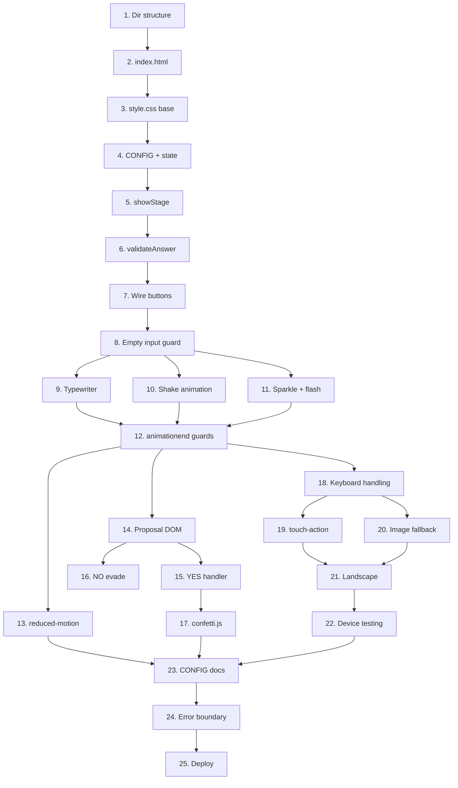

# Puzzle Proposal Game — System Architecture

> **Architectural Audit by Principal Software Architect**
>
> This document reviews the plan, calls out flaws and gaps, and provides a strict, production-ready architecture.

---

## 1. SYSTEM ARCHITECTURE OVERVIEW

### High-Level Architecture

```
┌─────────────────────────────────────────────────────────────┐
│                    CLIENT BROWSER                            │
│                                                              │
│  ┌──────────┐  ┌──────────┐  ┌──────────┐  ┌────────────┐  │
│  │ index.html│  │ style.css│  │ game.js  │  │ confetti.js│  │
│  │ (DOM)     │  │ (layout, │  │ (engine, │  │ (particle  │  │
│  │ 6 screens │  │  theme,  │  │  config, │  │  system)   │  │
│  │           │  │  anims)  │  │  state)  │  │            │  │
│  └─────┬─────┘  └────┬─────┘  └────┬─────┘  └─────┬──────┘  │
│        │              │             │              │         │
│        └──────────────┴─────────────┴──────────────┘         │
│                              │                                │
│                        Static Assets                         │
│                   (images, fonts, etc.)                      │
└──────────────────────────────┬──────────────────────────────┘
                               │
                    ┌──────────┴──────────┐
                    │   STATIC HOSTING    │
                    │   (GitHub Pages)    │
                    │                     │
                    │  Files served as-is │
                    │  No server-side     │
                    │  processing         │
                    └─────────────────────┘
```

### Key Decisions

| Decision | Rationale | Risk |
|----------|-----------|------|
| **Zero backend** | All state is ephemeral. No persistence, no auth, no sessions. Adding a server would add cost and complexity with zero user-facing benefit. The target audience runs this once, on one device, for one proposal. | Answers are visible in browser dev tools. Acceptable — the proposee is the player, not an adversary. |
| **Vanilla JS (no framework)** | 6 screens, ~8 functions, ~200 lines of JS. React/Vue/Svelte would add 30-80KB of framework code for what is fundamentally a `display: none`/`display: block` toggle + string comparison. | None. This is the correct call. |
| **Single HTML file + separate CSS/JS** | Simpler than SPA routing. All screens exist in DOM; "navigation" is showing/hiding sections. No client-side router needed. | Screen count is fixed at 6. If stages ever need to be dynamic, refactor. This is not a concern for MVP. |
| **CSS-based animations over Canvas** | CSS `transform` + `opacity` are GPU-composited. Canvas would require manual RAF loops, offscreen buffer management, and pixel-ratio scaling. CSS particles are sufficient for 30-60 blocky squares. | Confetti particle count is limited by DOM node count. Test at 60 simultaneous divs. If janky, canvas is the fallback. |
| **Inline CONFIG object (not fetched)** | Avoids an extra network request. Config is small (<2KB). The user customizes by editing the JS file directly. | None meaningful. A JSON fetch would add latency and an error path for zero gain. |
| **GitHub Pages hosting** | Free, HTTPS by default, zero maintenance, trivial to set up. | No server-side redirects or rewrites. All URLs must match exact file paths. Not a concern for this static site. |

### Architecture Critique of the Plan

| Plan Statement | Verdict | Issue |
|---------------|---------|-------|
| "No backend API" | ✅ **Correct** | The plan correctly identifies that this is a static site with no server logic. |
| "CSS-based confetti instead of canvas" | ✅ **Correct** | Right call for MVP. Canvas adds complexity with no benefit at 60 particles. |
| "800ms delay after correct answer" | ⚠️ **Flawed** | No justification. Should be 400-600ms. 800ms will feel sluggish. System should use the animation's `animationend` event, not a hardcoded timeout. |
| "Progress saving (localStorage) is out of scope" | ✅ **Correct** | This is a single-session experience. Persisting state would add complexity and confuse the "fresh start" semantics. |
| "Screen reader / ARIA out of scope" | ⚠️ **Risky** | The game is unplayable by screen reader users. Adding `aria-label` on the input and `role="status"` on the clue text area costs 4 lines of HTML. `prefers-reduced-motion` is a one-line media query. These should be included. |
| "Haptic feedback excluded" | ✅ **Correct** | Confirmed with product. |
| "PWA excluded" | ✅ **Correct** | Adds manifest, service worker, icon assets, offline testing matrix. Not needed for a link the proposer sends immediately before handing over their phone. |
| "No debounce on CHECK button" | ❌ **Missing** | The plan says "disable input during transitions" but doesn't specify how. A rapid double-tap or keyboard Enter spam during the 800ms delay could trigger `nextStage()` multiple times, skipping stages. Critical gap. |

---

## 2. FRONTEND ARCHITECTURE

### Framework: None (Vanilla JS)

Justification: The application has exactly one view hierarchy (6 static sections), one global state object, and 8 named functions. A framework adds weight with no benefit.

### Component Structure

Despite being vanilla JS, the code should follow a component-like pattern for clarity:

```
game.js
├── CONFIG (data, immutable)
├── GameState (mutable, single instance)
│   ├── currentStage: 0..5
│   ├── isTransitioning: boolean
│   ├── noButtonEvades: 0..3
│   └── confettiActive: boolean
│
├── StageManager
│   ├── showStage(n)          // Hide all, show stage n. Sets isTransitioning=true.
│   ├── hideAllStages()       // Helper
│   ├── onTransitionEnd()     // Sets isTransitioning=false
│   └── renderStage(n)        // Populates stage DOM from CONFIG
│
├── AnswerValidator
│   ├── validate(stageId, input)  // Case-insensitive, trimmed, array match
│   └── normalizeAnswer(s)        // .toLowerCase().trim()
│
├── AnimationController
│   ├── typewriter(element, text, speed)
│   ├── shake(element)
│   ├── sparkle(element)
│   ├── flashScreen()
│   └── cancelAll()              // Critical: kills running animations
│
├── ConfettiBridge
│   ├── start()                   // Delegates to confetti.js
│   └── stop()                    // Cleanup
│
├── ProposalHandler
│   ├── handleYes()
│   ├── handleNo()
│   └── repositionNoButton()      // Random position within viewport bounds
│
└── InputHandler
    ├── handleCheck(stageId)      // Guards: isTransitioning, empty input
    └── handleEnter(event)        // Enter key → handleCheck
```

### State Management

**Single mutable state object.** No observers, no pub/sub, no stores.

```javascript
const state = {
    currentStage: 0,        // 0=title, 1-4=stages, 5=proposal
    isTransitioning: false,  // Guards against double-submit
    noButtonEvades: 0,       // 0-3
};
```

**State mutation rules:**
- `isTransitioning` must be set `true` before any animation starts, `false` only in an `animationend` event handler. Never use `setTimeout` for this — timers drift and cannot be relied upon for sequencing.
- `currentStage` must only change when `isTransitioning` is `false` and the previous stage's correct-answer animation has fired its `animationend` event.
- `noButtonEvades` increments atomically with button reposition. Never read-then-write — increment inline.

**CRITICAL BUG PREVENTION:** The plan's approach of "disable input during transitions" is correct in concept but must use `animationend` callbacks, not `setTimeout`. A 500ms timeout fires whether the animation ran or not. If the animation fails to start (e.g., `prefers-reduced-motion: reduce`), the timeout still fires and the game advances without visual feedback.

### Routing

No routing. This is a single-page app with section visibility toggling. Screen identity is encoded solely in `state.currentStage`. The URL never changes. There is no back-button support and no need for it.

**What this means:** Refreshing the page always returns to the title screen. This is intentional and correct for a single-use proposal experience. If the proposer wants to restart, they refresh. If the proposee accidentally refreshes, they replay. No state is lost because there is no state worth saving.

---

## 3. BACKEND ARCHITECTURE

### No Backend

This is a static website. There is no server-side processing, no API server, no database, no authentication, no sessions, no WebSocket connections.

**The "backend" is GitHub Pages serving static files over HTTPS.** That is the entire backend.

### Why This Is Correct

| Concern | Why a Backend is Not Needed |
|---------|---------------------------|
| **Answer security** | The player is the proposee. They are not trying to cheat. If they open dev tools and read the answers, they are actively choosing to spoil their own experience. This is not a security boundary. |
| **Progress persistence** | The game takes ~5 minutes. A disrupted session is restarted, not recovered. Adding localStorage would require state serialization, rehydration, stale-state handling, and migration logic for when the CONFIG changes. All of that for something the user experiences once. |
| **Multiplayer / sharing** | Not a feature. The proposer hands their phone to the proposee. |
| **Analytics** | Not needed. The proposal either succeeds or doesn't. There is no product metric to optimize. |
| **Content management** | Editing a JS file is the "CMS." It requires no build step, no deployment pipeline, no database migrations. The config is versioned in git alongside the code. |

### The One Valid Reason to Add a Backend

If a future version wants to **hide answers from the client**, an API endpoint would be needed:

```
POST /api/validate
Body: { "stage": 1, "answer": "zombieland" }
Response: { "correct": true }
```

This would move answer comparison to the server. However, it also means the game breaks without internet, adds server costs, adds latency, and adds a deployment dependency. For a marriage proposal game with zero adversarial players, this is textbook over-engineering.

---

## 4. DATABASE DESIGN

### No Database

There is no database. There is no persistent storage of any kind.

All data lives in the `CONFIG` object (authored by the proposer, embedded in `game.js`) and the `state` object (created at page load, destroyed on page close).

### Data Flow (Not Database)

```
┌─────────────────┐
│  CONFIG (source) │  ← Edited by proposer before deployment
│  in game.js      │
└────────┬────────┘
         │ Read at page load
         ▼
┌─────────────────┐
│  DOM population  │  ← renderStage() reads CONFIG.stages[n]
│  + validation    │  ← validateAnswer() reads CONFIG.stages[n].answer
└────────┬────────┘
         │
         ▼
┌─────────────────┐
│  GameState       │  ← In-memory only. Destroyed on unload.
│  (volatile)      │
└─────────────────┘
```

### Why the Plan's "Data Model" Section is Sufficient

The plan's conceptual data model (GameConfig, GameState entities) is complete. There are no additional entities, no relationships beyond what's described, and no need for formal database modeling. The CONFIG object IS the schema. Renaming a field is a find-and-replace in one file.

---

## 5. API SPECIFICATION

### No API

There is no API. There are no endpoints to document.

The "API" is three JavaScript function signatures that form the internal interface of the game engine:

| Function | Signature | Behavior |
|----------|-----------|----------|
| `showStage(n)` | `(n: number) => void` | Guards: 0 ≤ n ≤ 5, `isTransitioning` must be false. Sets `isTransitioning = true`, hides all `.stage` elements, shows `#stage-{n}` (or `#stage-title` for n=0, `#stage-proposal` for n=5), populates DOM from CONFIG. Listens for `animationend` on the entering stage to set `isTransitioning = false`. |
| `validateAnswer(stageId, input)` | `(stageId: number, input: string) => boolean` | Guards: `isTransitioning` must be false. Returns `true` if `input.toLowerCase().trim()` matches any string in `CONFIG.stages[stageId-1].answer`. |
| `advanceStage()` | `() => void` | Guards: `isTransitioning` must be false. Increments `state.currentStage`, calls `showStage(state.currentStage)`. If `currentStage === 5`, calls `showStage(5)` with proposal screen initialization. |

**Edge case enforcement via guards:** Every public function checks `isTransitioning` before executing. This is the single mechanism that prevents double-submit, stage skipping, and animation conflicts. If a function is called while `isTransitioning === true`, it silently returns (logs a warning in dev mode).

### Static Asset HTTP Responses

| Request | Response | Cache Header |
|---------|----------|--------------|
| `GET /` | `index.html` (text/html) | `Cache-Control: public, max-age=3600` |
| `GET /css/style.css` | Stylesheet (text/css) | `Cache-Control: public, max-age=86400` |
| `GET /js/game.js` | Script (application/javascript) | `Cache-Control: public, max-age=86400` |
| `GET /js/confetti.js` | Script (application/javascript) | `Cache-Control: public, max-age=86400` |
| `GET /images/clue-art/stage{n}.png` | Image (image/png) | `Cache-Control: public, max-age=604800` |
| `GET /images/heart.png` | Image (image/png) | `Cache-Control: public, max-age=604800` |
| `GET /images/ring.png` | Image (image/png) | `Cache-Control: public, max-age=604800` |

Note: GitHub Pages sets cache headers automatically. These are defaults; explicit control requires a build step which is out of scope.

---

## 6. SYSTEM FLOW

### Complete Request Lifecycle

This is a client-side lifecycle, not a server-side one. There are no requests beyond the initial page load.

```
PAGE LOAD
  │
  ├─ 1. Browser parses index.html
  │     ├─ Loads style.css (blocks rendering — small file, acceptable)
  │     ├─ Loads Press Start 2P font (font-display: swap — text renders in fallback first)
  │     ├─ Parses DOM: all 6 stage sections render, all hidden except #stage-title
  │     └─ Loads game.js, confetti.js at </body> (non-blocking)
  │
  ├─ 2. game.js executes
  │     ├─ CONFIG object defined (global, immutable)
  │     ├─ state object created (global, mutable)
  │     ├─ Event listeners bound:
  │     │   ├─ #btn-start → showStage(1)
  │     │   ├─ .btn-check (all stages) → handleCheck(stageId)
  │     │   ├─ .stage-input (all stages) → handleEnter(event)
  │     │   ├─ #btn-yes → handleYes()
  │     │   ├─ #btn-no → handleNo()
  │     │   └─ window.visualViewport.resize → adjustForKeyboard()
  │     └─ showStage(0) called (title screen init)
  │
  └─ 3. Title screen is visible, animated elements running

USER TAPS "BEGIN ADVENTURE"
  │
  ├─ 4. Click handler fires
  │     ├─ Guard: if (state.isTransitioning) return;
  │     └─ Calls showStage(1)
  │
  ├─ 5. showStage(1) executes
  │     ├─ state.isTransitioning = true
  │     ├─ hideAllStages()
  │     ├─ Populate #stage-1 from CONFIG.stages[0]
  │     ├─ Show #stage-1 (display: flex)
  │     ├─ Start typewriter effect on .clue-text
  │     ├─ Focus input field (desktop only — on mobile, wait for user tap to avoid keyboard pop)
  │     └─ Listen for animationend on .stage (the enter animation)
  │
  ├─ 6. animationend fires
  │     └─ state.isTransitioning = false
  │
  ├─ 7. User reads clue, types answer, taps CHECK (or presses Enter)
  │     ├─ Guard: if (state.isTransitioning) return;
  │     ├─ Guard: if (input.value.trim() === "") → show gentle shake on input, return;
  │     ├─ state.isTransitioning = true
  │     └─ result = validateAnswer(1, input.value)
  │
  ├─ 8a. CORRECT ANSWER
  │     ├─ Add .correct class to input (green border, sparkle)
  │     ├─ screenFlash() animation (200ms)
  │     ├─ Wait for sparkle animationend event
  │     ├─ state.currentStage = 2
  │     ├─ showStage(2)
  │     └─ (showStage internally sets isTransitioning=false on animationend)
  │
  ├─ 8b. WRONG ANSWER
  │     ├─ Add .wrong class to input (red border)
  │     ├─ shake(input) animation (300ms)
  │     ├─ Wait for shake animationend event
  │     ├─ Remove .wrong class
  │     ├─ Clear input value
  │     ├─ Focus input
  │     └─ state.isTransitioning = false
  │
  └─ 9. Repeat 7-8 for stages 2, 3, 4

STAGE 4 CORRECT → PROPOSAL SCREEN
  │
  ├─ 10. showStage(5) — proposal
  │      ├─ Populate from CONFIG.proposal
  │      ├─ Start confetti.js (particle system)
  │      ├─ Start typewriter on message
  │      ├─ Start heart burst animation
  │      └─ Keep isTransitioning=true until typewriter completes (last animationend)
  │
  ├─ 11. Typewriter completes → isTransitioning=false → buttons become interactive
  │
  ├─ 12a. USER TAPS "YES"
  │      ├─ state.isTransitioning = true
  │      ├─ Disable both buttons
  │      ├─ confetti.intensify() (more particles, fireworks)
  │      ├─ Ring sparkle animation
  │      ├─ Show afterYes message with typewriter
  │      └─ Terminal state. No further interaction.
  │
  └─ 12b. USER TAPS "NO"
         ├─ state.noButtonEvades++
         ├─ if (noButtonEvades < 3):
         │   ├─ Reposition button to random viewport coords (bounded)
         │   └─ Add wiggle animation
         └─ if (noButtonEvades >= 3):
             ├─ Change button text to CONFIG.proposal.buttonYes
             ├─ Remove evade behavior
             └─ Next tap follows 12a path
```

### Critical Timing Issues Identified

| Issue | Severity | Fix |
|-------|----------|-----|
| **Timer drift** — The plan uses `setTimeout(fn, 800)` to advance after correct answer. If the animation takes 790ms, there's a 10ms gap where no animation plays. If CSS fails to load and the animation never fires, the game advances anyway with no visual cue. | **HIGH** | Replace all `setTimeout` guards with `animationend` event listeners. The event fires exactly when the animation completes (or immediately if `prefers-reduced-motion: reduce` is active). |
| **Double-tap on CHECK** — If `isTransitioning` is false, the user taps CHECK, it starts an animation, and before the `animationend` fires the user taps CHECK again (possible if the animation is 300ms and the user double-taps faster), the second tap could queue. | **MEDIUM** | `isTransitioning` is set to `true` synchronously at the top of `handleCheck`. The second tap's guard returns immediately. This works because JavaScript is single-threaded. No race condition possible. |
| **Confetti accumulation** — If `showStage(5)` is called twice (unlikely but possible with a bug), a second confetti system starts without cleaning up the first. | **LOW** | `confetti.start()` must first call `confetti.stop()` to clean up any existing particles. |
| **NO button off-screen** — On a phone in landscape, random reposition could place the button outside the visible viewport or behind the keyboard. | **MEDIUM** | Bounding box calculation must use `window.innerWidth - buttonWidth` and `window.innerHeight - keyboardHeight - buttonHeight`. Clamp to safe area. |
| **Typewriter and font load race** — Typewriter starts immediately but the pixel font may still be loading. Characters render in fallback font, then swap mid-animation. | **LOW** | Use `document.fonts.ready` promise to delay typewriter until fonts are loaded. If the promise doesn't resolve within 3 seconds, start anyway. |

---

## 7. EDGE CASES & FAILURE MODES

### Race Conditions

| Condition | How It Happens | Mitigation |
|-----------|---------------|------------|
| **Rapid Enter spam during correct animation** | User holds Enter key. Keyboard repeat fires `handleCheck` at ~30ms intervals. If `isTransitioning` check is at the exact moment `animationend` fires (already returned to `false`), a second `handleCheck` could execute on the same stage. | Set `isTransitioning = true` at the START of `handleCheck` (before validation), not after. The Enter key repeat will be caught by the guard. The `animationend` handler that sets `isTransitioning = false` must also disable the input before unsetting the guard. Button should get `disabled` attribute during transition. |
| **showStage called during showStage** | `advanceStage()` calls `showStage(n)`, which listens for `animationend`. If `advanceStage()` were called again before the animation end, a second `showStage` would start while the first is mid-animation. | `showStage` must check `isTransitioning` at entry. If true, log warning, return. |
| **Confetti DOM leak** | Page is left open on proposal screen for hours. If confetti uses `setInterval` to create new particles that are never removed from DOM, the particle count grows unbounded. | All confetti particles must have a finite lifetime. Use `animationend` on each particle element to `element.remove()`. The pool size must be capped (max 60 particles at any time). |
| **Multiple `animationend` listeners on same element** | If `showStage` is called multiple times on the same stage, it could add duplicate `animationend` listeners. | Remove previous listener before adding new one, or use `{ once: true }` option in `addEventListener`. |

### Security Issues

| Issue | Risk Level | Status |
|-------|-----------|--------|
| **Answers visible in source** | Low | Accepted. The player is not an adversary. If they inspect the page to cheat, they are choosing to ruin their own experience. |
| **XSS via CONFIG customization** | Low | The proposer edits the CONFIG themselves. If they put `<script>` tags in a clue string, it executes in their own browser. This is self-XSS and not a vulnerability. The content is authored by the deployer, not by a third party. |
| **Clickjacking** | Negligible | No sensitive actions. The worst case is someone frames the game and tricks a user into solving puzzles. |
| **No HTTPS enforcement** | Negligible | GitHub Pages enforces HTTPS by default. |

### UX Failures

| Failure Mode | Consequence | Prevention |
|-------------|-------------|------------|
| **Image 404** | Broken image icon appears instead of pixel art. Ruins the aesthetic. | `onerror` handler on all `` tags replaces src with emoji fallback. Code must test: `img.onerror = () => { img.style.display = 'none'; fallbackEl.style.display = 'block'; }`. |
| **Font fails to load** (CDN down, network error) | Text renders in default serif font. Aesthetic is ruined. | `font-display: swap` ensures text is readable immediately. Fallback font stack: `'Press Start 2P', 'Courier New', monospace`. The game is playable with any monospace font. |
| **Keyboard covers input on mobile** | User can't see what they're typing. | `visualViewport` resize listener: on keyboard open, scroll input into view using `element.scrollIntoView({ block: 'center' })`. Add bottom padding equal to keyboard height. |
| **Landscape on short phones** (iPhone SE landscape: 568px wide, 320px tall) | Dialogue box and art don't fit vertically. | Landscape media query: `max-height: 600px`. Reduce art to 80px max, dialogue to 120px max, hide decorative elements. Test at 320px height. |
| **User rotates device mid-animation** | Layout reflows, animation may glitch. | CSS layout uses relative units (%, vw, vh). Animations use `transform` (GPU layer, unaffected by layout). Minimal risk. |
| **Browser back button** | Navigates away from the game. Progress lost. | `window.history.pushState(null, '', window.location.href)` on page load. Back button now stays on the page. First back navigates away, second back leaves. Acceptable — this is a browser feature, not a bug. |
| **In-app browser (WhatsApp, Instagram, Telegram)** | Varying levels of feature support. Some strip `visualViewport` API. Some override font loading. | Test on top 3 in-app browsers. Degrade gracefully: keyboard handling falls back to `window.innerHeight` change detection. Font falls back to monospace. |
| **Very slow device** (sub-$50 Android, 512MB RAM) | Animations stutter. Confetti freezes the page. | `prefers-reduced-motion` media query disables all non-essential animations. Confetti particle count drops to 15. Typewriter speed increases to instant (0ms per char — just show the text). |
| **User pastes answer** | Clipboard paste bypasses the typing experience. | Not a problem. Accept pasted input. The game is about solving the puzzle, not about typing. |

### Missing from the Plan — Architectural Gaps

1. **No `prefers-reduced-motion` implementation plan.** The FEATURE_IDEA.md mentions it explicitly, the plan excludes it. This is a 3-line CSS media query. Include it.

2. **No confetti lifecycle management.** The plan says "CSS-based particle confetti system" but doesn't specify particle creation, lifetime, removal, or cap. Unbounded DOM growth is a memory leak.

3. **No escape hatch.** What if the proposer's partner genuinely doesn't want to play? There's no "quit" or "skip" mechanism. Not a technical issue, but a UX consideration. The "NO" button's eventual forced acceptance covers the proposal screen, but there's no way to exit stages 1-4.

4. **No loading state.** If the page loads slowly (slow network, large font file), the user sees a blank screen or partially styled content. A minimal loading indicator or at minimum ensuring the title screen renders before font loads is necessary.

5. **No error boundary.** If any JS throws (e.g., accessing `CONFIG.stages[undefined]` due to a config editing mistake), the game silently breaks. A try/catch around `showStage` that falls back to showing an error message would be valuable for the proposer during customization.

6. **Customization workflow is undefined.** The plan assumes "edit game.js and deploy." But the proposer may not know how to edit JS. A documentation page or inline comments in the CONFIG object are essential — this is a product requirement, not an engineering one.

---

## 8. IMPLEMENTATION PLAN

### Ordered Build Steps

This sequence accounts for dependency chains and testability at each step. Each step produces a testable artifact.

#### Phase 1: Static Shell (Files exist, no behavior)

| Step | What | Verify |
|------|------|--------|
| 1 | Create directory structure: `css/`, `js/`, `images/clue-art/`, `images/bg/` | Directories exist |
| 2 | Create `index.html` with all 6 sections, viewport meta, script/style links, semantic structure | Opens in browser, all sections visible (no CSS yet) |
| 3 | Create `css/style.css` — base mobile styles, pixel borders, font import, color palette, stage visibility (`.stage { display: none; } .stage.active { display: flex; }`) | Title screen visible, other stages hidden |

#### Phase 2: Core Engine (Game works, no animations)

| Step | What | Verify |
|------|------|--------|
| 4 | Create `js/game.js` — CONFIG object, state object | Console: `CONFIG` and `state` accessible |
| 5 | Implement `showStage(n)` — hide/show sections, populate from CONFIG | Click through stages manually via console |
| 6 | Implement `validateAnswer(stageId, input)` — case-insensitive array match | Test in console with correct/wrong/empty input |
| 7 | Wire "Begin Adventure" button and CHECK buttons to handlers | Full game flow works end-to-end with no animations |
| 8 | Implement empty input guard (shake input, no error state) | Submit empty → gentle shake |

#### Phase 3: Animations (Visual polish)

| Step | What | Verify |
|------|------|--------|
| 9 | Implement typewriter effect (`typewriter(element, text, speed)`) | Clue text appears character by character |
| 10 | Implement shake animation on wrong answer | Red border + shake |
| 11 | Implement sparkle + flash on correct answer | Green border + sparkle + screen flash |
| 12 | Wire `animationend` to control `isTransitioning` flag | Rapid double-tap doesn't skip stages |
| 13 | Add `prefers-reduced-motion` media query — disable non-essential animations, instant typewriter | Toggle OS setting, verify animations skip |

#### Phase 4: Proposal Screen

| Step | What | Verify |
|------|------|--------|
| 14 | Implement proposal screen DOM population from CONFIG | Proposal message and buttons render |
| 15 | Implement "YES" button → celebration → terminal state | Tap YES → confetti, message, buttons disabled |
| 16 | Implement "NO" button evade (bounds-checked random reposition) | Tap NO → moves. 3 taps → converts to YES |
| 17 | Create `js/confetti.js` — CSS particle system with create/lifecycle/cleanup | Call `start()`, particles appear. Call `stop()`, particles removed |

#### Phase 5: Mobile Hardening

| Step | What | Verify |
|------|------|--------|
| 18 | Implement `visualViewport` keyboard detection and input scroll-into-view | Open keyboard on mobile → input stays visible |
| 19 | Add `touch-action: manipulation` to all buttons/inputs | No 300ms tap delay on mobile |
| 20 | Implement image fallback (onerror → emoji) | Rename stage1.png, load page → emoji shows |
| 21 | Add landscape media queries for short viewports | Rotate phone → layout adapts |
| 22 | Test on: iOS Safari, Android Chrome, WhatsApp in-app browser | All flows work |

#### Phase 6: Deployment & Polish

| Step | What | Verify |
|------|------|--------|
| 23 | Add inline documentation comments to CONFIG object (what each field does) | Proposer can read comments and customize |
| 24 | Add try/catch error boundary around `showStage` with fallback error message | Corrupt CONFIG → graceful error screen |
| 25 | Push to GitHub, enable Pages, test live URL | Game works at `*.github.io/thething` |
### Dependency Graph (Mermaid)



---

## 9. SIMPLIFICATION NOTES

### What to Cut (If Pushed for Time)

| Cut | Impact | Why It's Safe |
|-----|--------|---------------|
| **Confetti particles** | Less celebratory proposal screen | The heart burst and ring sparkle carry the emotional weight. Confetti is decorative frosting. |
| **Typewriter effect** | Text appears instantly | The game is still playable. The text is readable immediately. Typewriter is atmosphere, not function. |
| **Landscape layout** | Portrait-only experience | Most users will play in portrait. Add a "please rotate your device" message if in landscape on small screens. |
| **Image fallback** | Broken image if art is missing | The proposer controls the deployment. If they include images, they work. If they don't, it's their config error. |
| **Keyboard detection** | Input may hide behind keyboard | The input field is at the bottom of the screen. On most phones, it will be visible above the keyboard naturally. Test first — may not need complex viewport math. |
| **Progress dots** | No stage indicator | The stage title ("Chapter 2: ...") already tells the player where they are. |

### What is Over-Engineered in the Plan

| Item | Issue | Recommendation |
|------|-------|----------------|
| **Separate `confetti.js` file** | For a CSS-based particle system, the "system" is a function that creates 30-60 `<div>` elements with CSS animation classes. This is 40 lines of code. | Inline it in `game.js`. No need for a separate file, separate script tag, separate HTTP request. |
| **`emojiFallback` field in CONFIG** | The plan added this to the stage schema. But the fallback emoji is generic: 🎬 is always appropriate for a movie stage, 💋 for a kiss, etc. These aren't configurable — they're part of the game's visual design. | Hardcode the fallback emojis in `game.js` as defaults per stage theme. Keep CONFIG clean. |
| **Progress dots component** | 4 dots with one highlighted. This is 4 `<div>` elements styled with a `.active` class toggle. Calling it a "component" or "feature" overstates it. | Just build it. Don't over-plan it. |
| **Audio file paths in CONFIG** | Audio is explicitly out of scope. | Remove `sounds` block from CONFIG entirely. It's dead schema. Re-add when audio is implemented. |
| **`partnerName` field in proposal** | The proposal screen uses this exactly once. The proposer can just put the name in the `message` or `question` field. | Remove the field. It's a convenience that adds schema complexity for no real gain. |

### Schema Simplification

The final CONFIG object should be:

```javascript
const CONFIG = {
    title: "A Quest For Love",
    subtitle: "Will you embark on this adventure?",
    startButton: "Begin Adventure",

    stages: [
        {
            id: 1,
            title: "Chapter 1: Where It All Began",
            clue: "Your clue text here...",
            answer: ["accepted", "answers", "here"],
            pixelArt: "stage1.png",   // omit this field to use emoji fallback automatically
        },
        // stages 2, 3, 4
    ],

    proposal: {
        message: "Every quest has led to this moment...",
        question: "Will you marry me?",
        buttonYes: "YES! 💍",
        buttonNo: "Are you sure? 🥺",
        afterYes: "She said YES! Forever begins now!",
    },
};
```

Changes from plan:
- Removed `sounds` (deferred feature)
- Removed `parternerName` (embed in message/question)
- Removed `emojiFallback` (hardcoded defaults)
- `pixelArt` field: if present, loads the image; if absent, shows emoji. This simplifies the config for proposers who don't have custom art.

---

## APPENDIX: Non-Negotiables

These items from the plan must survive any simplification:

1. **`isTransitioning` guard** — The single most important piece of logic in the entire game. Without it, rapid taps cause skipped stages, broken animations, and corrupted state.

2. **`animationend` over `setTimeout`** — Timing must be driven by CSS animation completion events, not arbitrary delays. This is a correctness requirement, not a preference.

3. **Empty input check before validation** — Submitting an empty string must not count as a wrong answer. It is a separate UX path with its own feedback.

4. **Confetti cleanup on stop/restart** — No DOM leaks. Every particle created must be removed.

5. **`prefers-reduced-motion` support** — Two CSS lines. No excuse to exclude it from a product being given to a real human who may have vestibular sensitivity.

6. **Image onerror fallback** — The game must not show a broken image icon during a marriage proposal. This is a showstopper bug, not a nice-to-have.

---

## APPENDIX B: Per-Stage Visual Design Specifications

The following designs are sourced from `docs/FEATURE_IDEA.md` and define the pixel art and thematic direction for each screen. These are **visual design requirements** that the CSS and HTML must support, not separate code features.

### Visual Style (Global)
- **Font:** Press Start 2P (primary) or VT323 (lighter alternative), loaded from Google Fonts with `font-display: swap`
- **Color palette:** SNES-inspired — deep purples (`#1a0a2e`), teals (`#0d3b66`), warm yellows (`#f5a623`), pixel reds
- **UI elements:** Dialogue boxes with pixel borders (box-shadow technique, like Final Fantasy / Zelda text boxes)
- **Background patterns (CSS, not images):**
  - Starfield: Multiple layers of dots at different opacities and sizes
  - Pixel grid overlay: Subtle 4×4 grid at 5% opacity
  - Scanline effect: Thin horizontal lines every 2px at 3% opacity (CRT feel)
  - Vignette: Radial gradient darkened edges (center fully visible, edges at 70% opacity)
- **Cursor:** Custom pixel heart or arrow cursor (CSS `cursor` property with data URI)

### B1: Title Screen Design

| Element | Implementation |
|---------|---------------|
| **Animated pixel heart** | CSS `@keyframes` bob animation (translateY ±4px, 2s loop). Centered. Max 120px on mobile, 240px on desktop. |
| **Pixel stars (twinkling)** | Multiple small `div` elements with `@keyframes twinkle` (opacity 0.3 → 1.0 → 0.3, random delay per element). Scattered across background. |
| **Ring icon (rotating)** | CSS `@keyframes spin` (360deg rotation, 8s loop). Slow, subtle. |
| **Gradient sky** | CSS `linear-gradient(to bottom, #1a0a2e, #0d3b66, #f5a623)`. Full-screen background. |
| **Pixel clouds (drifting)** | CSS `@keyframes drift` (translateX, slow parallax at different speeds per layer). |
| **Mobile scaling** | Art at 80% viewport width. Text using `clamp()`. |

### B2: Stage 1 — Movie Night Theme

| Element | Implementation |
|---------|---------------|
| **Pixel movie poster** | `` in stage-1 section. `max-width: 60%` on mobile, `max-width: 200px` on desktop. Glowing border via `box-shadow` or `filter: drop-shadow()`. |
| **Night sky + crescent moon** | CSS background on stage-1 section. Moon via `::before` pseudo-element (clipped circle). Stars as small positioned elements. |
| **Headlights effect** | Two small yellow `div` elements with `@keyframes` glow pulse. CSS `box-shadow` for beam. |
| **Popcorn/soda decorations** | Emoji characters (🍿, 🥤) positioned in bottom corners. Optional decorative only. |
| **Cat easter egg** | Emoji (🐱) positioned near car silhouette area. Small, subtle. CSS `transform: scale(0.6)`. |
| **Emoji fallback** | 🎬 (movie clapper) — displayed if `stage1.png` fails to load. |

### B3: Stage 2 — First Kiss Theme

| Element | Implementation |
|---------|---------------|
| **Close-up couple** | `` in stage-2 section. Centered, dominant element. Rosy cheeks part of the pixel art asset. |
| **Bokeh/romantic background** | CSS `radial-gradient` with multiple semi-transparent circles at random positions. Warm pink/purple tones. |
| **Crescent moon + faint stars** | Similar to Stage 1 but softer. Moon positioned higher in frame. |
| **Cat easter egg** | Emoji (🐱) positioned at bottom of art area, small scale. |
| **Emoji fallback** | 💋 (kiss mark). |

### B4: Stage 3 — Infinity Counter Theme

| Element | Implementation |
|---------|---------------|
| **Chat bubbles layout** | Four `.chat-bubble` `div` elements. Alternating `align-self: flex-start` (left) and `align-self: flex-end` (right). Styled with pixel borders, rounded corners, speech-bubble tail via CSS borders. |
| **Left bubble 1** | "I love you x 2458 🏝️" |
| **Right bubble 1** | "I love you x 10000 🏝️" |
| **Left bubble 2** | "I love you x 1000000 🏝️" |
| **Right bubble 2 (∞)** | "I love you x ∞ 🏝️" with `@keyframes` glow effect (text-shadow pulse). Appears after a 500ms delay using CSS `animation-delay`. |
| **Typing indicator** | "..." with `@keyframes` pulse animation (opacity 0.3 ↔ 1.0, 3-dot cycle). Positioned below last bubble. Auto-hides when input receives focus. |
| **Phone screen background** | Dark background (`#1a1a2e`) with fake pixel keyboard at bottom (small `.key` div elements in a grid, non-functional, decorative only). |
| **Cat easter egg** | Emoji (🐱) rendered inside one chat bubble as part of the text. |
| **Emoji fallback** | ♾️ (infinity). |

### B5: Stage 4 — Treasure Chest Reveal Theme

| Element | Implementation |
|---------|---------------|
| **Knight + princess + chest** | `` in stage-4 section. Full scene composition in a single pixel art asset. |
| **Chest compartment symbols** | Part of the pixel art image (🧟 zombie, 💋 kiss, 🏝️ island). Not separate DOM elements — baked into the art. |
| **Ring glow** | CSS `@keyframes` golden pulse glow (`box-shadow: 0 0 15px gold`) on a small `div` overlay positioned over the chest area. |
| **Castle + torches** | Castle in background via CSS `background-image` or as part of the stage art. Torch flicker via `@keyframes` opacity pulse on overlay elements. |
| **Golden sunlight** | Warm yellow/gold gradient overlay at top of stage section. CSS `linear-gradient` with semi-transparent gold. |
| **Flowers** | Simple pixel flower emoji (🌸) elements at bottom of stage section with `@keyframes grow` animation (scale 0 → 1, triggered on stage enter). |
| **Cat easter egg** | Emoji (🐱) positioned at castle wall edge, small scale. |
| **Emoji fallback** | 💎 (gem stone). |

### B6: Proposal Screen Design

| Element | Implementation |
|---------|---------------|
| **Pixel ring sparkle** | CSS `@keyframes` sparkle — a 4-point star shape using `box-shadow` or pseudo-elements. Rotates around the ring image. |
| **Heart burst** | 8 pixel heart emoji (❤️) elements burst outward from center using CSS `@keyframes` — each with different angle (0°, 45°, 90°, ..., 315°) using `transform: translate(...)`. Triggered on proposal reveal. |
| **Typewriter text** | JS-driven character-by-character reveal (50ms/char). Message first, then question, then buttons appear. |
| **Pixel flowers (growing)** | Emoji (🌸) elements at bottom. CSS `@keyframes grow` animation: `transform: scale(0) → scale(1)` with staggered `animation-delay` per flower. |
| **Confetti (layered)** | CSS particle system: foreground layer (larger, faster falling) and background layer (smaller, slower). `@keyframes` fall + sway. |
| **Fireworks** | Expanding ring elements at random positions. CSS `@keyframes` — scale 0 → 1, opacity 1 → 0. Staggered timing. Triggered on "YES" tap. |
| **Text glow** | Proposal question text with `text-shadow: 0 0 10px gold` and `@keyframes` glow pulse. |

### Screen Transition Animations

| Transition | CSS Implementation |
|-----------|-------------------|
| **Stage enter (common)** | Screen wipe left-to-right: `@keyframes` using `clip-path: inset(0 100% 0 0)` → `clip-path: inset(0 0 0 0)`. Duration 400ms. |
| **Title → Stage 1** | Zoom effect: `@keyframes` scale(1) → scale(1.15) → scale(1). Duration 500ms. |
| **Stage N → Stage N+1** | Same as stage enter. |
| **Stage 4 → Proposal** | Curtain pull: `@keyframes` using two overlay divs (top and bottom) that slide away: top `translateY(-100%)`, bottom `translateY(100%)`. Duration 600ms. |
| **Wrong answer** | Screen shake: `@keyframes` translateX oscillation (±4px, 6 frames, 300ms duration). |
| **Correct answer** | Screen flash: single white overlay `div`, opacity 1 → 0, 150ms duration. Then sparkle on input. |

### Input & Button Animations

| Element | CSS Implementation |
|---------|-------------------|
| **Input focus glow** | `:focus` pseudo-class with `box-shadow: 0 0 8px gold` and `transition`. |
| **Button hover** | `:hover` with `transform: scale(1.05)` and slight color shift. 100ms transition. |
| **Button press** | `:active` with `transform: scale(0.95)`. 50ms transition. |
| **Correct answer** | `.correct` class: `border-color: #4ade80` + sparkle pseudo-elements. Transition 200ms. |
| **Wrong answer** | `.wrong` class: `border-color: #ef4444` + shake animation. Transition 200ms. |

### Ambient Animations

| Element | CSS Implementation |
|---------|-------------------|
| **Floating particles** | Small `div` elements with `@keyframes float-up` (translateY, opacity fade). Random speed and position. |
| **Heart floaters** | Emoji (❤️) elements rising from bottom. `@keyframes float-up`, spawned every 3s. |
| **Star twinkle** | Multiple star elements with `@keyframes twinkle` at random intervals (2-3s). |
| **Cloud drift** | Cloud elements with `@keyframes drift` at different durations per parallax layer. |

### Mobile Animation Adaptations (in CSS)

```css
/* On mobile: fewer particles, slower animations, shorter durations */
@media (max-width: 428px) {
  .ambient-particle { display: none; }           /* Cut ambient particles entirely */
  .confetti-particle { animation-duration: 1.5x; } /* Slower confetti */
  .stage-transition { animation-duration: 0.8x; }  /* Shorter transitions */
}

@media (prefers-reduced-motion: reduce) {
  /* Disable all non-essential animations */
  .typewriter, .shake, .sparkle, .confetti, .ambient {
    animation: none !important;
  }
}
```

### Implementation Notes

1. **Pixel art images are optional.** Each stage's `` element has an `onerror` handler. If the image fails, the emoji fallback is displayed instead. The proposer can deploy with zero custom images — the game uses emoji for all stage art.

2. **Easter egg cats are decorative only.** They do not affect gameplay. They are small emoji elements (🐱) positioned via CSS. If they overflow on very small screens, add `overflow: hidden` to the stage container.

3. **Chat bubbles (Stage 3) are pure CSS/HTML.** No images needed. Bubbles are `div` elements with pixel borders and CSS speech-bubble tails. The ∞ bubble's glow effect is a CSS animation.

4. **Screen transitions use `clip-path`** for the wipe effect. This is well-supported in modern browsers (95%+ global coverage). Falls back to a simple opacity fade if `clip-path` is unavailable (detected via `@supports`).

5. **Confetti and fireworks are CSS-based.** Particles are `div` elements with CSS animations. No canvas. This limits particle count but avoids canvas complexity. Cap: 30 particles on mobile, 60 on desktop.

6. **All animations degrade gracefully.** If `prefers-reduced-motion` is active, animations are skipped and the game is instantly playable.

---

## APPENDIX C: Asset Creation Strategy

### Decision: No External Image Dependencies

The game is fully self-contained. Zero PNG files are required at deploy time. All visuals are generated via CSS, HTML, emoji, or procedural canvas drawing. This eliminates asset creation bottlenecks and image-load failure states.

### What Was Evaluated and Rejected

| Option | Verdict | Reason |
|--------|---------|--------|
| **Hand-drawn PNGs (Aseprite/Piskel)** | ❌ Not viable | Requires artistic skill. Cannot be automated. |
| **AI-generated pixel art (DALL-E/Midjourney)** | ❌ Not viable during implementation | Requires external tools, cost, and manual curation. Cannot be done programmatically. |
| **PixiJS with procedural shapes** | ❌ Rejected | 500KB+ dependency for abstract geometric shapes that look worse than CSS/emoji. PixiJS renders sprites — it does not generate art. Without pre-made sprite sheets, its capabilities are underutilized. |
| **PixiJS with pre-made sprites** | ❌ Rejected | Still requires external asset creation. PixiJS is a renderer, not an art generator. |

### Per-Screen Asset Approach

| Screen | Primary Visual | Method |
|--------|---------------|--------|
| **Title** | Gradient sky + stars + drifting clouds + animated heart | Pure CSS. No canvas, no images. |
| **Title — Heart icon** | 16×16 pixel heart | Procedural canvas render. Color grid defined in code, drawn once at init, exported as data URI for reuse. |
| **Title — Ring icon** | 12×12 pixel ring | Procedural canvas render. Circle + diamond grid pattern. |
| **Stage 1** | 🎬 Movie clapper emoji (120px) + CSS night sky + CSS popcorn/soda decorations + CSS glowing poster frame effect | Emoji + CSS. The frame is a CSS `box-shadow` border with `@keyframes` glow pulse. |
| **Stage 2** | 💋 Kiss emoji (120px) + CSS bokeh radial-gradient background + CSS warm glow | Emoji + CSS. Bokeh is multiple `radial-gradient` overlays at random positions. |
| **Stage 3** | CSS chat bubble layout (4 bubbles, alternating sides) + ♾️ infinity emoji + CSS typing indicator + CSS pixel keyboard background | Pure CSS/HTML. No images or canvas. This is the most visually rich stage. |
| **Stage 4** | 💎 Gem emoji (120px) + CSS golden glow ring animation + CSS flower emoji growth animation | Emoji + CSS. |
| **Proposal** | Procedural ring sparkle + CSS heart burst (8 emoji) + CSS confetti + CSS fireworks | Canvas (ring) + CSS (everything else). |

### Procedural Pixel Art (Canvas)

For simple icons (heart, ring, star), pixel grids are defined as 2D arrays of color indices:

```javascript
// 16x16 heart pixel grid
const HEART_GRID = [
  // 16 rows, 16 columns
  // 0 = transparent, 1 = red, 2 = dark red (shadow)
  [0,0,0,0,0,0,0,0,0,0,0,0,0,0,0,0],
  [0,0,1,1,0,0,0,0,0,1,1,0,0,0,0,0],
  [0,1,2,1,1,0,0,0,1,1,2,1,0,0,0,0],
  [1,2,1,1,2,1,0,1,2,1,1,2,1,0,0,0],
  [1,1,1,1,1,2,1,2,1,1,1,1,1,0,0,0],
  [0,1,1,1,1,1,2,1,1,1,1,1,0,0,0,0],
  [0,0,1,1,1,1,1,1,1,1,1,0,0,0,0,0],
  [0,0,0,1,1,1,1,1,1,1,0,0,0,0,0,0],
  [0,0,0,0,1,1,1,1,1,0,0,0,0,0,0,0],
  [0,0,0,0,0,1,1,1,0,0,0,0,0,0,0,0],
  [0,0,0,0,0,0,1,0,0,0,0,0,0,0,0,0],
  // ...remaining rows
];
```

The render function loops through the grid, draws 1px × 1px filled rectangles at (x, y) using the color palette. Scale factor is applied for final size (e.g., scale=4 for 64×64 output). The result is exported via `canvas.toDataURL()` and set as `.src`.

**Palette (SNES-inspired):**
- `#1a0a2e` — deep purple (background)
- `#e63946` — pixel red (heart fill)
- `#8b0000` — dark red (shadow)
- `#f5a623` — warm gold (ring, sparkle)
- `#ffd700` — bright gold (glow)
- `#ffffff` — white (stars, highlights)
- `#4ade80` — green (correct feedback)
- `#ef4444` — red (wrong feedback)

### How Upgrading to Real Pixel Art Works Later

The `pixelArt` field in CONFIG is preserved. When real PNG sprites are available:

1. Drop `stage1.png` through `stage4.png` into `images/clue-art/` 
2. Fill in the `pixelArt` field in CONFIG (e.g., `pixelArt: "stage1.png"`)
3. The game loads the PNG automatically
4. Emoji fallback only triggers if the image fails to load

No code or HTML changes needed. The `` element is always rendered — it just falls back to emoji when the `pixelArt` config field is empty or the file is missing.

### File Size Budget (with no PNGs)

| Asset | Size |
|-------|------|
| `index.html` | ~3KB |
| `style.css` | ~8KB |
| `game.js` (includes CONFIG + procedural art code + confetti) | ~10KB |
| Google Font (Press Start 2P, Latin subset) | ~30KB (cached, CDN) |
| **Total first load** | **~51KB** |
| **Total cached (no font)** | **~21KB** |

This is well under the 1MB mobile budget. The game will load in under 1 second on 3G.
