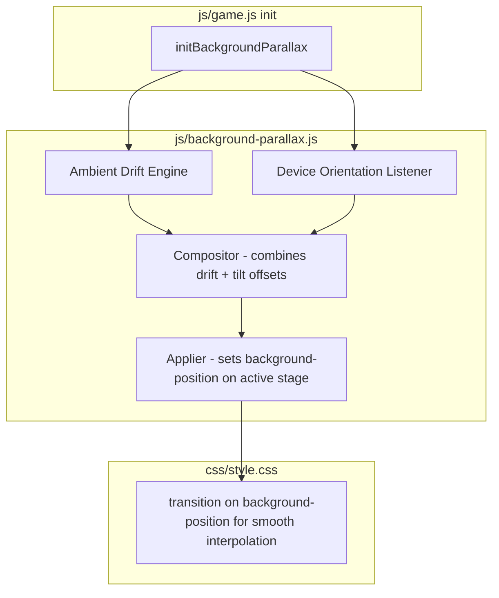

# Hybrid Background Parallax + Ambient Drift — Technical Specification

## Overview

On mobile (≤600px), portrait background images use `background-size: cover`, cropping portions of the image. This feature adds two layered, passive effects that reveal hidden regions without requiring user gestures or toggles:

1. **Ambient Drift** — A slow, always-on Lissajous curve animation that gently pans the background over a ~40s cycle
2. **Device Orientation Parallax** — Phone tilt shifts `background-position` proportionally, creating a "window into the scene" effect

Both effects compose additively. The drift runs continuously; parallax layers on top when gyroscope data is available.

---

## Architecture Diagram



---

## Component 1: Ambient Drift Engine

### Purpose
Provide a baseline, always-visible subtle motion that slowly reveals different cropped regions of the background image. Works on all devices regardless of gyroscope support.

### Algorithm
- Use a **Lissajous curve** parameterized by time for organic figure-8 motion
- X offset: `AmplitudeX * sin(a * t + phaseX)`
- Y offset: `AmplitudeY * sin(b * t + phaseY)`
- Frequency ratio `a:b = 1:2` creates a clean figure-8 pattern

### Configuration
| Parameter | Value | Rationale |
|---|---|---|
| Cycle duration | ~40 seconds | Slow enough to be barely noticeable during active play, visible when idle |
| Max X amplitude | ±8% of viewport width | Enough to reveal cropped edges without exposing empty space |
| Max Y amplitude | ±5% of viewport height | Less vertical movement since portrait images have more headroom vertically |
| Update interval | 16ms (requestAnimationFrame) | Smooth 60fps animation |

### Lifecycle
- Starts when first stage with a background image activates
- Pauses during stage transitions (`state.isTransitioning === true`)
- Resumes after transition completes
- Stops on title screen (no background image) and proposal screen (different visual treatment)

---

## Component 2: Device Orientation Parallax

### Purpose
Map physical phone tilt to background-position shifts, creating the illusion of looking through a window into the scene.

### Algorithm
1. Listen for `deviceorientation` events
2. Extract `beta` (-180° to 180°, front-back tilt) and `gamma` (-90° to 90°, left-right tilt) values
3. Normalize to [-1, 1] range using calibrated neutral zone
4. Apply exponential moving average smoothing to reduce jitter
5. Map to background-position percentage offsets

### Configuration
| Parameter | Value | Rationale |
|---|---|---|
| Max parallax offset | ±10% beyond drift amplitude | Parallax adds noticeable depth without overwhelming the scene |
| Smoothing factor (EMA alpha) | 0.15 per frame | Balances responsiveness with smoothness |
| Neutral zone threshold | ±3° | Small tilts ignored to prevent drift when phone is "flat" |
| Deadzone on non-mobile | Disabled entirely | Feature only active at ≤600px viewport width |

### iOS Permission Flow
- iOS 13+ requires explicit user permission for `DeviceOrientationEvent`
- Request permission on first user interaction (reuse existing tap-to-start overlay or add a subtle prompt)
- If denied, parallax is disabled but ambient drift continues unaffected
- Implement a one-time permission request; do not re-prompt per stage

### Mapping Table
```
Gamma (left-right tilt):
  -90° (tilt left)   → background-position-x shifts RIGHT (+10%)
  +90° (tilt right)  → background-position-x shifts LEFT (-10%)

Beta (front-back tilt):
  -30° (tilt back toward face) → background-position-y shifts DOWN (+5%)
  +30° (tilt forward away)     → background-position-y shifts UP (-5%)
```

**Rationale:** Opposite-direction mapping creates the "window" illusion — tilting left reveals what's on the right side of the image, like peering around a corner.

---

## Component 3: Compositor & Applier

### Purpose
Combine drift and parallax offsets into a single `background-position` value applied to the active stage element.

### Logic
```javascript
finalX = 50% + driftX + parallaxX;   // 50% = center baseline
finalY = 50% + driftY + parallaxY;

activeStage.style.backgroundPosition = `${finalX}% ${finalY}%`;
```

### Stage Transition Handling
- On `showStage()` call, reset both drift phase and parallax offsets to zero
- Apply a brief pause (300ms) before resuming drift to avoid jarring position jumps
- Use CSS transition on `background-position` for smooth interpolation during resets

---

## Integration Points

### New File: `js/background-parallax.js`
Self-contained module exposing two functions:
```javascript
// Called from game.js init()
function initBackgroundParallax();

// Called from showStage(n) after stage becomes active
function activateForStage(stageElement);
```

### Changes to `js/game.js`
1. Import new module at top of file
2. Call `initBackgroundParallax()` in `init()` function
3. Call `activateForStage(target)` in `showStage()` after `target.classList.add('active')`

### Changes to `css/style.css`
Add transition property for smooth background-position changes:
```css
.stage.active {
    transition: background-position 0.3s ease-out;
}
```

---

## Edge Cases & Fallbacks

| Scenario | Behavior |
|---|---|
| No gyroscope (desktop, some Android) | Ambient drift runs normally, parallax disabled silently |
| iOS permission denied | Same as no gyroscope — drift continues |
| `deviceorientation` API not supported | Feature detects and skips parallax setup |
| Stage has no background image (title screen) | Both effects inactive |
| Rapid stage transitions | Drift pauses during transitions, resets on each new stage |
| Portrait ↔ landscape rotation mid-stage | Recalibrate amplitudes based on new viewport dimensions |
| Screen locked / app in background | Animation frame loop pauses automatically by browser |

---

## Performance Considerations

- Single `requestAnimationFrame` loop handles both drift and parallax composition
- DOM writes batched to once-per-frame via the applier
- No additional image loading — uses existing background-image already on stage elements
- CSS `will-change: background-position` hint added to active stage for GPU compositing
- Memory footprint minimal: ~5 state variables + event listeners

---

## Testing Checklist

- [ ] Ambient drift visible when holding phone still for 10+ seconds
- [ ] Tilting phone left/right shifts background in opposite direction
- [ ] Tilting phone forward/back shifts background vertically
- [ ] Smooth transitions between stages with no position jumps
- [ ] Works on iOS Safari after granting motion permission
- [ ] Graceful degradation on Android without gyroscope
- [ ] No performance impact during confetti / particle effects
- [ ] Effect inactive on title screen and proposal screen as intended
